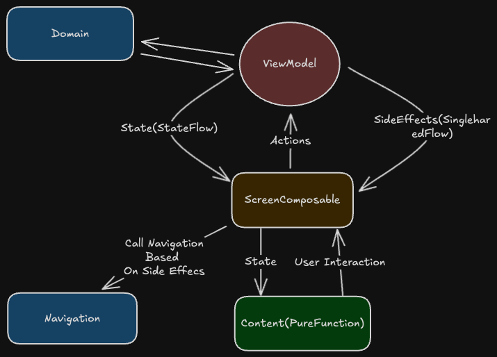

# MyMovieList [1.0.0]

**MyMovieList** é um app Android para amantes de cinema descobrirem novos filmes para assistir. Com base no que está popular entre os usuários, o app permite visualizar mais detalhes sobre os filmes e adicioná-los à sua lista pessoal de interesse.

> Os filmes populares são obtidos da [TMDb](https://www.themoviedb.org/) (The Movie Database) usando sua API.

## 📑 Índice

* [Funcionalidades](#-funcionalidades)
* [Stack Tecnológico](#-stack-tecnológico)
* [Visão Geral da Arquitetura](#visão-geral-da-arquitetura)
* [Funcionalidades/Melhorias Futuras](#funcionalidadesmelhorias-futuras)
* [Planejamento e Roadmap](#-planejamento-e-roadmap)
* [Licença](#-licença)
* [Changelog](#-changelog)

## 🎬 Funcionalidades

* 🔍 Lista infinita de filmes populares
* 📄 Visualização de informações detalhadas de cada filme
* ⭐ Adicionar ou remover filmes da lista pessoal de interesse

<p align="center">
  
  
  
</p>

## 🧰 Stack Tecnológico

Este projeto é construído utilizando ferramentas e bibliotecas modernas do desenvolvimento Android:

* **Linguagem**: Kotlin
* **UI**: Jetpack Compose + Material3
* **Arquitetura**: MVVM + Clean Architecture + Modularização (em progresso) + Version Catalogs
* **Networking**: [Ktor Client](https://ktor.io/) + Kotlinx Serialization + SLF4J (Logging)
* **Gerenciamento de Estado**: ViewModel + Kotlin Flow
* **Navegação**: Jetpack Navigation para Compose
* **Injeção de Dependência**: Hilt
* **Armazenamento Local**: Room
* **Programação Assíncrona**: Coroutines + Flow

Para testes, o projeto garante um alto nível de qualidade com:

* **Testes Unitários**: JUnit4
* **Mocking**: Mockk
* **Asserts**: Truth + funções infix personalizadas para asserts idiomáticos e significativos
* **Ferramentas**: Utilitários de teste customizados para facilitar os testes de ViewModels e UseCases

## Visão Geral da Arquitetura

**Arquitetura Geral**:
Cada módulo do app segue os princípios da Clean Architecture, separando responsabilidades em três camadas principais:

* **Data Layer**: Responsável por fontes de dados, incluindo rede e armazenamento local. Utiliza repositórios para abstrair o acesso aos dados.
* **Domain Layer**: Contém a lógica de negócio e os use cases. Define a funcionalidade central do app, independente de frameworks.
* **Presentation Layer**: Implementa a UI usando Jetpack Compose. Utiliza ViewModels para gerenciar os dados da UI respeitando o ciclo de vida.

**Estrutura de Modularização**:


> \* Embora a modularização ainda não esteja completamente implementada, a estrutura de pacotes do projeto já foi pensada para permitir a separação fácil de features em módulos.

* Tipos de Módulo:

    * `app`: Módulo principal da aplicação que inclui o ponto de entrada, configuração geral, navegação e DI.
    * `core`: Contém utilitários compartilhados, classes base e componentes comuns, como o cliente de rede, base de arquitetura, utilitários de teste, etc.
    * `common`: Contém lógica de negócio comum e utilitários reutilizáveis entre diferentes features, como interações com a watchlist.
    * `features`: Contém módulos específicos de cada feature, como listagem de filmes, detalhes do filme, etc. Cada módulo pode ser desenvolvido e testado de forma independente.

**Implementação do MVVM**:
<br>


* A camada de apresentação utiliza uma classe base `MyMoviesViewModel` para facilitar a construção de UIs com unidirectional data flow, onde a UI apenas renderiza o `state` e reage a `side effects`.

    * Os estados são expostos via `StateFlow` para fácil observação na UI usando a extensão `collectAsStateWithLifecycle`.
    * Efeitos colaterais são gerenciados via `SingleSharedFlow` garantindo que sejam emitidos apenas uma vez e não repetidos em mudanças de configuração.
    * Ações iniciais podem ser executadas via o composable `OnStartSideEffect`, que garante que a ação ocorra apenas na primeira composição.
* Utilitários como `ViewModelTest` facilitam o teste de ViewModels, permitindo configuração simples e asserts claros.

```kotlin
viewModelTest(watchListViewModel) {
    coEvery { getWatchListUseCase.invoke() } returns Result.success(movies)

    viewModelUnderTest.getWatchList()
    advanceUntilIdle()

    states.first() assertIsEqualTo WatchListState.Loading
    states.last() assertIsEqualTo WatchListState.Success(movies)
}
```

## Funcionalidades/Melhorias Futuras

**Funcionalidades**
As seguintes funcionalidades estão planejadas para versões futuras:

* Funcionalidade de busca de filmes
* Diferentes tipos de listas de filmes (ex.: mais bem avaliados, lançamentos)
* Compartilhamento de detalhes de filmes com amigos
* Descobrir onde assistir os filmes (plataformas de streaming)
* Compartilhamento da watchlist com amigos

**Melhorias**

* Adicionar limite de itens na lista infinita para reduzir uso de memória
* Adicionar camada de cache para reduzir chamadas de rede e melhorar performance
* Implementar completamente a modularização
* Implementar testes na data layer e testes de UI para features (snapshots e testes de ponta a ponta dos fluxos principais)
* Implementar pipeline de CI/CD para testes automatizados e deploy
* Implementar mecanismo de tratamento de erros mais robusto
* Melhorar a UI/UX com animações e transições

## 🗺️ Planejamento e Roadmap

As funcionalidades planejadas são acompanhadas via Issues e milestones no GitHub. O projeto segue o modelo de desenvolvimento trunk-based (embora gitflow também seja uma opção), onde features são desenvolvidas em branches e depois mescladas na branch principal.
As versões são controladas com [Semantic Versioning](https://semver.org/spec/v2.0.0.html) e uso de tags.

## 📄 Licença

Este projeto está licenciado sob a licença MIT. Veja o arquivo [LICENSE](LICENSE) para mais detalhes.

## 📝 Changelog

Todas as mudanças relevantes são documentadas no arquivo [CHANGELOG.md](CHANGELOG.md).
