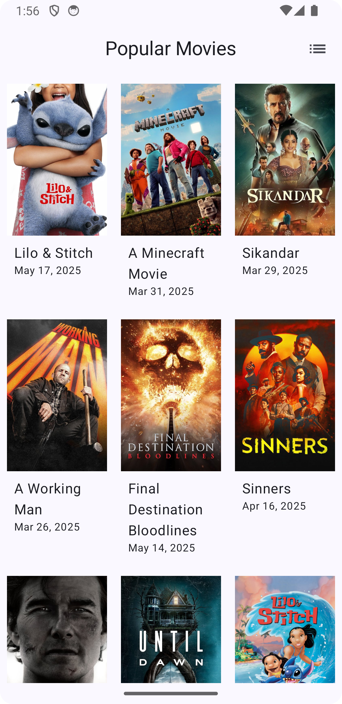
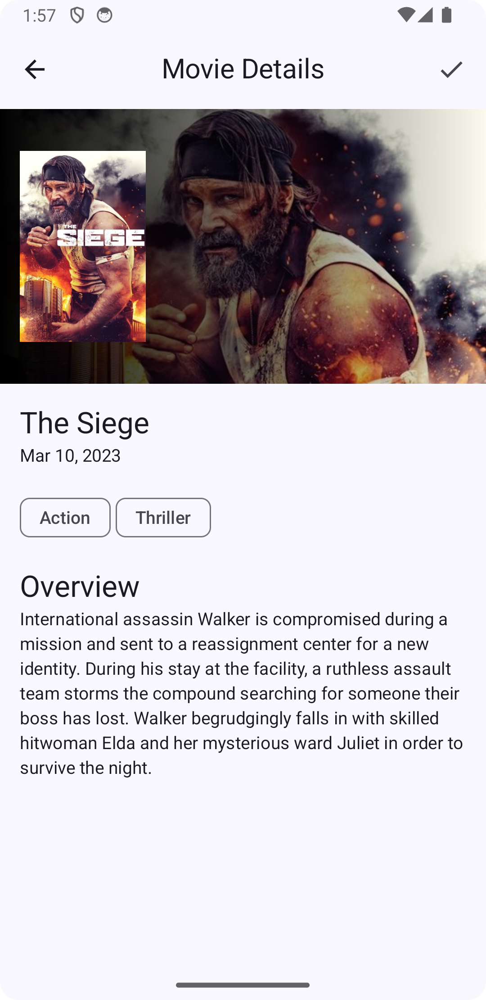
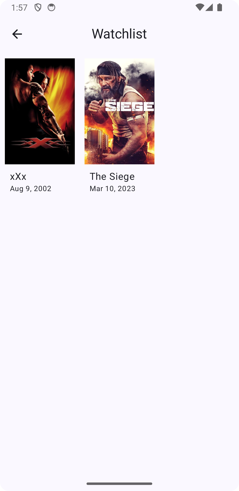
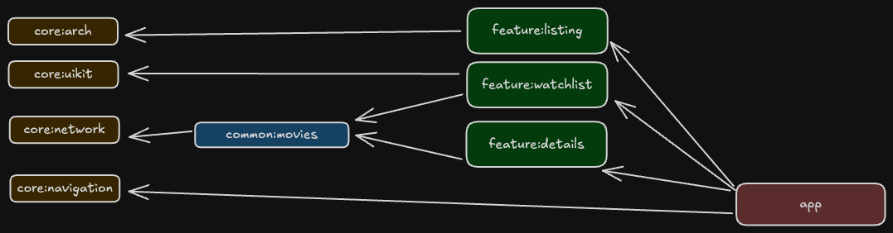
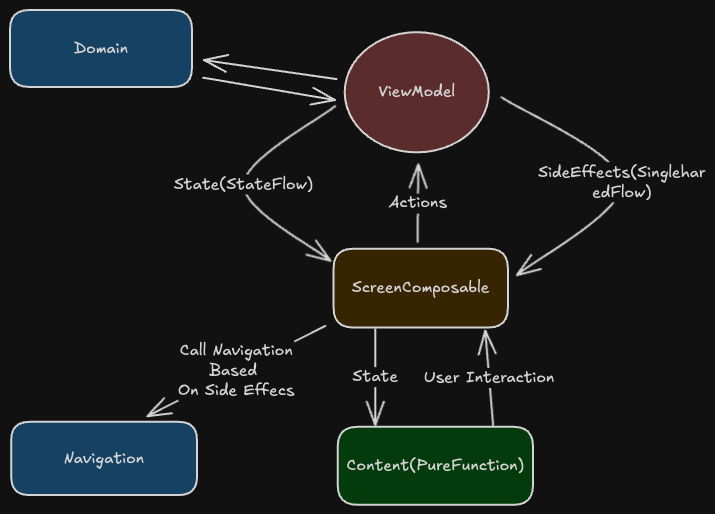

# MyMovieList [1.0.0] | [PT-BR](README.BR.md)
**MyMovieList** is a Android for movie lovers to discover new movies to watch, based on watch is
popular among users, the user can see more details about the movie, and add it to their personal watchlist.
> The popular movies are fetched from [TMDb](https://www.themoviedb.org/) (The Movie Database) using their API.

## 📑 Table of Contents
- [Features](#-features)
- [Tech Stack](#-tech-stack)
- [Architecture Overview](#architecture-overview)
- [Upcoming Features/Improvements](#upcoming-featuresimprovements)
- [Planning & Roadmap](#-roadmap--planning)
- [License](#-license)
- [Changelog](#-changelog)

## 🎬 Features
- 🔍 Infinity list of popular movies
- 📄 View detailed information for each movie
- ⭐ Add or remove movies from a personal watchlist

<p align="center">
  
  
  
</p>

## 🧰 Tech Stack

This project is built using modern Android development tools and libraries:
- **Language**: Kotlin
- **UI**: Jetpack Compose + Material3
- **Architecture**: MVVM + Clean Architecture + Modularization(In progress) + Version Catalogs
- **Networking**: [Ktor Client](https://ktor.io/) + Kotlinx Serialization + SLF4J(Logging)
- **State Management**: ViewModel + Kotlin Flow
- **Navigation**: Jetpack Navigation for Compose
- **Dependency Injection**: Hilt
- **Local Storage**: Room
- **Asynchronous Programming**: Coroutines + Flow

For testing, the project and guarantees a high level of quality with:
- **Unit Testing**: JUnit4
- **Mocking**: Mockk
- **Assertion**: Truth + Custom infix functions idiomatic and meaningful assertions
- **Tooling**: Custom test utilities to facilitate testing of ViewModels and UseCases

## Architecture Overview
**Overall Architecture**:
Each of the apps modules are structured following the principles of Clean Architecture, which separates concerns into three main layers:
- **Data Layer**: Responsible for data sources, including network and local storage. It uses repositories to abstract data access.
- **Domain Layer**: Contains business logic and use cases. It defines the core functionality of the app, independent of any frameworks.
- **Presentation Layer**: Implements the UI using Jetpack Compose. It uses ViewModels to manage UI-related data in a lifecycle-conscious way.

**Modularization Structure**:

> \* Altough modularization is not fully implemented yet, the project package structure is structured to allow for easy separation of features into modules.
- Module Types:
  - `app`: The main application module that includes the entry point and overall app configuration and were all the navigation and DI wiring is done.
  - `core`: Contains shared utilities, base classes, and common components used across the app like network client, base arch classes, test utilities etc.
  - `common`: Contains common business logic and utilities that can be reused across different features. eg Interacting with the watchlist
  - `features`: Contains feature-specific modules, each representing a distinct part of the app, such as movie listing, movie details, etc. Each feature module can be developed and tested independently.

**MVVM implementation**:
<br>

- The presentation layer uses a base `MyMoviesViewModel` class to facilitate building UIs using unidirectional
data flow, where ui simply renders the `state`  adn reacts to  `side effects`.
  - States are exposed as `StateFlow` for easy observation in the UI using a `collectAsStateWithLifecycle` extension function.
  - Side effects are managed using a `SingleSharedFlow` to ensure they are emitted only once and not replayed on configuration changes.
  - Startup actions can be performed using an `OnStartSideEffect` composable, which ensures actions are only called on the first composition.
- `ViewModelTest` utilities are provided to facilitate testing of ViewModels, allowing for easy setup and assertions.
```kotlin
viewModelTest(watchListViewModel) {
    coEvery { getWatchListUseCase.invoke() } returns Result.success(movies)

    viewModelUnderTest.getWatchList()
    advanceUntilIdle()

    states.first() assertIsEqualTo WatchListState.Loading
    states.last() assertIsEqualTo WatchListState.Success(movies)
}
```

## Upcoming Features/Improvements
**Features**
The following features are planned for future releases:
- Movie search functionality
- Different kinds of movie lists (e.g., top-rated, upcoming)
- Sharing movie details with friends
- Discovering where to watch movies (streaming platforms)
- Sharing watchlist with friends
- Add support for other languages and regions

**Improvements**
- Adding a limit of movies on the infinity scroll list so whe limit the amount of data in memory
- Add a caching layer to reduce network calls and improve performance
- Implementing the modularization of the project
- Implement tests on the data layer and ui tests for the features(snapshots and end-to-end tests for core flows)
- Implementing a CI/CD pipeline for automated testing and deployment
- Implementing a more robust error handling mechanism
- Improving the UI/UX with animations and transitions

## 🗺️ Roadmap & Planning

The project's planned features and how progress is tracked using GitHub Issues and milestones, the project
follows a trunk-based development model(although gitflow is also an option), where features are developed
in branches and merged into the main branch when complete.
And version are controlled using [Semantic Versioning](https://semver.org/spec/v2.0.0.html), and tags

## 📄 License

This project is licensed under the MIT License. See the [LICENSE](LICENSE) file for details.

## 📝 Changelog

All notable changes are documented in [CHANGELOG.md](CHANGELOG.md).

